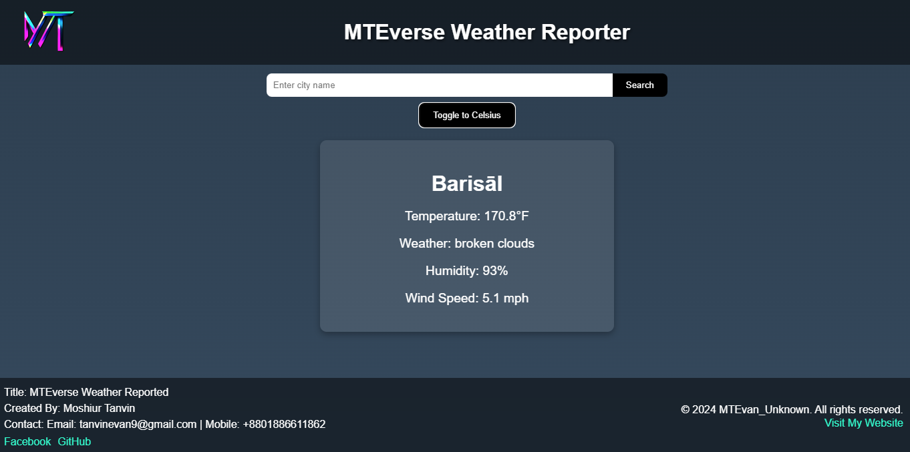

# MTEverse Weather App

 <!-- Update this path based on where your logo is stored -->

## Overview
The MTEverse Weather App is a simple and intuitive weather application that allows users to view current weather conditions for a specific location. The app features a sleek, futuristic design, with the ability to toggle between Celsius and Fahrenheit, search for different cities, and view weather information including temperature, humidity, and wind speed.

## Features
- **Search Functionality**: Users can search for weather information by entering a city or location name.
- **Weather Information Display**:
  - Current temperature
  - Weather description (e.g., sunny, rainy, cloudy)
  - Humidity percentage
  - Wind speed
- **Error Handling**: Displays error messages when a city is not found or if there’s a network issue.
- **Unit Toggle**: Option to switch between Celsius and Fahrenheit for temperature.
- **Geolocation**: Automatically fetch weather based on the user's current location (optional).
- **Responsive Design**: The app works well on both desktop and mobile devices.

## Screenshots

## Technologies Used
- **React**: Frontend library for building user interfaces.
- **Vite**: A build tool that provides a fast development experience.
- **OpenWeatherMap API**: Public API used to fetch weather data.
- **CSS**: Styling for the application.# Weather-Reporter
# Weather-Reporter
# Weather-Reporter
